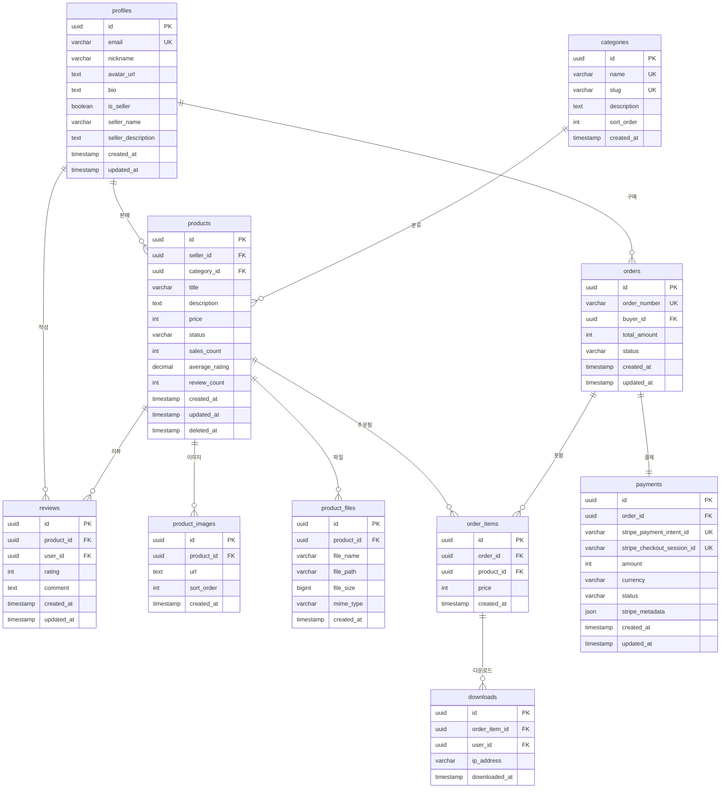

# ShopCraft - DB 설계

## 1. ERD (Entity Relationship Diagram)



## 2. 테이블 상세 명세

### 2.1 profiles (사용자 프로필)

> Supabase Auth의 `auth.users` 테이블과 1:1 연동. `id`는 `auth.users.id`와 동일.

| 컬럼명 | 타입 | NULL | 기본값 | 설명 |
|--------|------|------|--------|------|
| `id` | `UUID` | NO | - | PK, auth.users.id 참조 |
| `email` | `VARCHAR(255)` | NO | - | 이메일 (고유) |
| `nickname` | `VARCHAR(50)` | YES | `NULL` | 닉네임 |
| `avatar_url` | `TEXT` | YES | `NULL` | 프로필 이미지 URL |
| `bio` | `TEXT` | YES | `NULL` | 자기소개 |
| `is_seller` | `BOOLEAN` | NO | `false` | 판매자 여부 |
| `seller_name` | `VARCHAR(100)` | YES | `NULL` | 판매자 상호명 |
| `seller_description` | `TEXT` | YES | `NULL` | 판매자 소개 |
| `created_at` | `TIMESTAMPTZ` | NO | `now()` | 생성일시 |
| `updated_at` | `TIMESTAMPTZ` | NO | `now()` | 수정일시 |

**인덱스:**
| 인덱스명 | 컬럼 | 타입 | 용도 |
|----------|-------|------|------|
| `profiles_pkey` | `id` | PRIMARY | PK |
| `profiles_email_key` | `email` | UNIQUE | 이메일 중복 방지 |
| `profiles_is_seller_idx` | `is_seller` | BTREE | 판매자 목록 조회 |

**제약조건:**
- `id` → `auth.users(id)` ON DELETE CASCADE
- `nickname` 최소 2자, 최대 50자
- `seller_name`은 `is_seller = true`일 때만 NOT NULL 권장 (앱 레벨 검증)

---

### 2.2 categories (카테고리)

| 컬럼명 | 타입 | NULL | 기본값 | 설명 |
|--------|------|------|--------|------|
| `id` | `UUID` | NO | `gen_random_uuid()` | PK |
| `name` | `VARCHAR(50)` | NO | - | 카테고리명 |
| `slug` | `VARCHAR(50)` | NO | - | URL 슬러그 |
| `description` | `TEXT` | YES | `NULL` | 카테고리 설명 |
| `sort_order` | `INTEGER` | NO | `0` | 정렬 순서 |
| `created_at` | `TIMESTAMPTZ` | NO | `now()` | 생성일시 |

**인덱스:**
| 인덱스명 | 컬럼 | 타입 | 용도 |
|----------|-------|------|------|
| `categories_pkey` | `id` | PRIMARY | PK |
| `categories_name_key` | `name` | UNIQUE | 이름 중복 방지 |
| `categories_slug_key` | `slug` | UNIQUE | 슬러그 중복 방지 |
| `categories_sort_order_idx` | `sort_order` | BTREE | 정렬 조회 |

**초기 데이터 (Seed):**
| name | slug |
|------|------|
| 템플릿 | templates |
| 아이콘 | icons |
| 폰트 | fonts |
| UI 키트 | ui-kits |
| 이북 / 가이드 | ebooks |
| 사진 / 이미지 | photos |
| 기타 | others |

---

### 2.3 products (상품)

| 컬럼명 | 타입 | NULL | 기본값 | 설명 |
|--------|------|------|--------|------|
| `id` | `UUID` | NO | `gen_random_uuid()` | PK |
| `seller_id` | `UUID` | NO | - | FK → profiles.id |
| `category_id` | `UUID` | NO | - | FK → categories.id |
| `title` | `VARCHAR(200)` | NO | - | 상품 제목 |
| `description` | `TEXT` | NO | - | 상품 상세 설명 |
| `price` | `INTEGER` | NO | - | 가격 (원 단위, 최소 100) |
| `status` | `VARCHAR(20)` | NO | `'draft'` | 상태: draft, active, inactive |
| `sales_count` | `INTEGER` | NO | `0` | 총 판매 수 |
| `average_rating` | `DECIMAL(3,2)` | NO | `0.00` | 평균 평점 (0.00~5.00) |
| `review_count` | `INTEGER` | NO | `0` | 리뷰 수 |
| `created_at` | `TIMESTAMPTZ` | NO | `now()` | 생성일시 |
| `updated_at` | `TIMESTAMPTZ` | NO | `now()` | 수정일시 |
| `deleted_at` | `TIMESTAMPTZ` | YES | `NULL` | 삭제일시 (소프트 삭제) |

**인덱스:**
| 인덱스명 | 컬럼 | 타입 | 용도 |
|----------|-------|------|------|
| `products_pkey` | `id` | PRIMARY | PK |
| `products_seller_id_idx` | `seller_id` | BTREE | 판매자별 상품 조회 |
| `products_category_id_idx` | `category_id` | BTREE | 카테고리별 상품 조회 |
| `products_status_idx` | `status` | BTREE | 상태별 필터링 |
| `products_created_at_idx` | `created_at` | BTREE DESC | 최신순 정렬 |
| `products_sales_count_idx` | `sales_count` | BTREE DESC | 인기순 정렬 |
| `products_price_idx` | `price` | BTREE | 가격 범위 필터링 |
| `products_title_search_idx` | `title` | GIN (tsvector) | 텍스트 검색 |

**제약조건:**
- `seller_id` → `profiles(id)` ON DELETE CASCADE
- `category_id` → `categories(id)` ON DELETE RESTRICT
- `price` >= 100 (최소 100원)
- `status` IN ('draft', 'active', 'inactive')
- `average_rating` BETWEEN 0.00 AND 5.00
- `deleted_at IS NULL` 조건으로 소프트 삭제 필터링

---

### 2.4 product_images (상품 이미지)

| 컬럼명 | 타입 | NULL | 기본값 | 설명 |
|--------|------|------|--------|------|
| `id` | `UUID` | NO | `gen_random_uuid()` | PK |
| `product_id` | `UUID` | NO | - | FK → products.id |
| `url` | `TEXT` | NO | - | 이미지 URL (Supabase Storage) |
| `sort_order` | `INTEGER` | NO | `0` | 이미지 정렬 순서 |
| `created_at` | `TIMESTAMPTZ` | NO | `now()` | 생성일시 |

**인덱스:**
| 인덱스명 | 컬럼 | 타입 | 용도 |
|----------|-------|------|------|
| `product_images_pkey` | `id` | PRIMARY | PK |
| `product_images_product_id_idx` | `product_id, sort_order` | BTREE | 상품별 이미지 정렬 조회 |

**제약조건:**
- `product_id` → `products(id)` ON DELETE CASCADE
- 상품당 최대 5개 이미지 (앱 레벨 검증)

---

### 2.5 product_files (상품 파일)

| 컬럼명 | 타입 | NULL | 기본값 | 설명 |
|--------|------|------|--------|------|
| `id` | `UUID` | NO | `gen_random_uuid()` | PK |
| `product_id` | `UUID` | NO | - | FK → products.id |
| `file_name` | `VARCHAR(255)` | NO | - | 원본 파일명 |
| `file_path` | `VARCHAR(500)` | NO | - | Storage 내 경로 |
| `file_size` | `BIGINT` | NO | - | 파일 크기 (bytes) |
| `mime_type` | `VARCHAR(100)` | NO | - | MIME 타입 |
| `created_at` | `TIMESTAMPTZ` | NO | `now()` | 생성일시 |

**인덱스:**
| 인덱스명 | 컬럼 | 타입 | 용도 |
|----------|-------|------|------|
| `product_files_pkey` | `id` | PRIMARY | PK |
| `product_files_product_id_idx` | `product_id` | BTREE | 상품별 파일 조회 |

**제약조건:**
- `product_id` → `products(id)` ON DELETE CASCADE
- `file_size` <= 52428800 (50MB 제한)

---

### 2.6 orders (주문)

| 컬럼명 | 타입 | NULL | 기본값 | 설명 |
|--------|------|------|--------|------|
| `id` | `UUID` | NO | `gen_random_uuid()` | PK |
| `order_number` | `VARCHAR(20)` | NO | - | 주문번호 (SC-YYYYMMDD-XXXX) |
| `buyer_id` | `UUID` | NO | - | FK → profiles.id |
| `total_amount` | `INTEGER` | NO | - | 총 결제 금액 (원) |
| `status` | `VARCHAR(20)` | NO | `'pending'` | 주문 상태 |
| `created_at` | `TIMESTAMPTZ` | NO | `now()` | 생성일시 |
| `updated_at` | `TIMESTAMPTZ` | NO | `now()` | 수정일시 |

**주문 상태 (status):**
| 상태 | 설명 |
|------|------|
| `pending` | 결제 대기 |
| `paid` | 결제 완료 |
| `failed` | 결제 실패 |
| `refunded` | 환불 완료 |

**인덱스:**
| 인덱스명 | 컬럼 | 타입 | 용도 |
|----------|-------|------|------|
| `orders_pkey` | `id` | PRIMARY | PK |
| `orders_order_number_key` | `order_number` | UNIQUE | 주문번호 중복 방지 |
| `orders_buyer_id_idx` | `buyer_id` | BTREE | 구매자별 주문 조회 |
| `orders_status_idx` | `status` | BTREE | 상태별 필터링 |
| `orders_created_at_idx` | `created_at` | BTREE DESC | 최신순 정렬 |

**제약조건:**
- `buyer_id` → `profiles(id)` ON DELETE RESTRICT
- `status` IN ('pending', 'paid', 'failed', 'refunded')
- `total_amount` > 0

---

### 2.7 order_items (주문 상세)

| 컬럼명 | 타입 | NULL | 기본값 | 설명 |
|--------|------|------|--------|------|
| `id` | `UUID` | NO | `gen_random_uuid()` | PK |
| `order_id` | `UUID` | NO | - | FK → orders.id |
| `product_id` | `UUID` | NO | - | FK → products.id |
| `price` | `INTEGER` | NO | - | 구매 당시 가격 (원) |
| `created_at` | `TIMESTAMPTZ` | NO | `now()` | 생성일시 |

**인덱스:**
| 인덱스명 | 컬럼 | 타입 | 용도 |
|----------|-------|------|------|
| `order_items_pkey` | `id` | PRIMARY | PK |
| `order_items_order_id_idx` | `order_id` | BTREE | 주문별 상품 조회 |
| `order_items_product_id_idx` | `product_id` | BTREE | 상품별 주문 조회 |
| `order_items_order_product_key` | `order_id, product_id` | UNIQUE | 주문 내 상품 중복 방지 |

**제약조건:**
- `order_id` → `orders(id)` ON DELETE CASCADE
- `product_id` → `products(id)` ON DELETE RESTRICT
- `price` > 0

---

### 2.8 payments (결제)

| 컬럼명 | 타입 | NULL | 기본값 | 설명 |
|--------|------|------|--------|------|
| `id` | `UUID` | NO | `gen_random_uuid()` | PK |
| `order_id` | `UUID` | NO | - | FK → orders.id |
| `stripe_payment_intent_id` | `VARCHAR(255)` | YES | `NULL` | Stripe PaymentIntent ID |
| `stripe_checkout_session_id` | `VARCHAR(255)` | YES | `NULL` | Stripe Checkout Session ID |
| `amount` | `INTEGER` | NO | - | 결제 금액 (원) |
| `currency` | `VARCHAR(3)` | NO | `'krw'` | 통화 코드 |
| `status` | `VARCHAR(20)` | NO | `'pending'` | 결제 상태 |
| `stripe_metadata` | `JSONB` | YES | `NULL` | Stripe 응답 메타데이터 |
| `created_at` | `TIMESTAMPTZ` | NO | `now()` | 생성일시 |
| `updated_at` | `TIMESTAMPTZ` | NO | `now()` | 수정일시 |

**결제 상태 (status):**
| 상태 | 설명 |
|------|------|
| `pending` | 결제 대기 |
| `succeeded` | 결제 성공 |
| `failed` | 결제 실패 |
| `refunded` | 환불 완료 |

**인덱스:**
| 인덱스명 | 컬럼 | 타입 | 용도 |
|----------|-------|------|------|
| `payments_pkey` | `id` | PRIMARY | PK |
| `payments_order_id_key` | `order_id` | UNIQUE | 주문당 1건 결제 |
| `payments_stripe_pi_key` | `stripe_payment_intent_id` | UNIQUE | Stripe PI 중복 방지 |
| `payments_stripe_cs_key` | `stripe_checkout_session_id` | UNIQUE | Stripe CS 중복 방지 |
| `payments_status_idx` | `status` | BTREE | 상태별 조회 |

**제약조건:**
- `order_id` → `orders(id)` ON DELETE RESTRICT
- `status` IN ('pending', 'succeeded', 'failed', 'refunded')
- `amount` > 0
- `currency` 기본값 'krw'

---

### 2.9 downloads (다운로드 기록)

| 컬럼명 | 타입 | NULL | 기본값 | 설명 |
|--------|------|------|--------|------|
| `id` | `UUID` | NO | `gen_random_uuid()` | PK |
| `order_item_id` | `UUID` | NO | - | FK → order_items.id |
| `user_id` | `UUID` | NO | - | FK → profiles.id |
| `ip_address` | `VARCHAR(45)` | YES | `NULL` | 다운로드 IP (IPv6 대응) |
| `downloaded_at` | `TIMESTAMPTZ` | NO | `now()` | 다운로드 일시 |

**인덱스:**
| 인덱스명 | 컬럼 | 타입 | 용도 |
|----------|-------|------|------|
| `downloads_pkey` | `id` | PRIMARY | PK |
| `downloads_order_item_id_idx` | `order_item_id` | BTREE | 주문 항목별 다운로드 조회 |
| `downloads_user_id_idx` | `user_id` | BTREE | 사용자별 다운로드 조회 |

**제약조건:**
- `order_item_id` → `order_items(id)` ON DELETE CASCADE
- `user_id` → `profiles(id)` ON DELETE CASCADE

---

### 2.10 reviews (리뷰)

| 컬럼명 | 타입 | NULL | 기본값 | 설명 |
|--------|------|------|--------|------|
| `id` | `UUID` | NO | `gen_random_uuid()` | PK |
| `product_id` | `UUID` | NO | - | FK → products.id |
| `user_id` | `UUID` | NO | - | FK → profiles.id |
| `rating` | `INTEGER` | NO | - | 별점 (1~5) |
| `comment` | `TEXT` | YES | `NULL` | 리뷰 텍스트 |
| `created_at` | `TIMESTAMPTZ` | NO | `now()` | 생성일시 |
| `updated_at` | `TIMESTAMPTZ` | NO | `now()` | 수정일시 |

**인덱스:**
| 인덱스명 | 컬럼 | 타입 | 용도 |
|----------|-------|------|------|
| `reviews_pkey` | `id` | PRIMARY | PK |
| `reviews_product_id_idx` | `product_id` | BTREE | 상품별 리뷰 조회 |
| `reviews_user_id_idx` | `user_id` | BTREE | 사용자별 리뷰 조회 |
| `reviews_product_user_key` | `product_id, user_id` | UNIQUE | 상품당 사용자 1개 리뷰 |

**제약조건:**
- `product_id` → `products(id)` ON DELETE CASCADE
- `user_id` → `profiles(id)` ON DELETE CASCADE
- `rating` BETWEEN 1 AND 5

---

## 3. 관계(Relationship) 요약

| 관계 | 타입 | 설명 |
|------|------|------|
| profiles → products | 1:N | 한 판매자가 여러 상품 등록 |
| profiles → orders | 1:N | 한 구매자가 여러 주문 |
| profiles → reviews | 1:N | 한 사용자가 여러 리뷰 작성 |
| categories → products | 1:N | 한 카테고리에 여러 상품 |
| products → product_images | 1:N | 한 상품에 여러 이미지 |
| products → product_files | 1:N | 한 상품에 여러 파일 |
| products → order_items | 1:N | 한 상품이 여러 주문에 포함 |
| products → reviews | 1:N | 한 상품에 여러 리뷰 |
| orders → order_items | 1:N | 한 주문에 여러 상품 |
| orders → payments | 1:1 | 한 주문에 한 결제 |
| order_items → downloads | 1:N | 한 주문 항목에 여러 다운로드 기록 |

## 4. Prisma 스키마 초안

```prisma
generator client {
  provider = "prisma-client-js"
}

datasource db {
  provider  = "postgresql"
  url       = env("DATABASE_URL")
  directUrl = env("DIRECT_URL")
}

model Profile {
  id                String    @id @db.Uuid
  email             String    @unique @db.VarChar(255)
  nickname          String?   @db.VarChar(50)
  avatarUrl         String?   @map("avatar_url")
  bio               String?
  isSeller          Boolean   @default(false) @map("is_seller")
  sellerName        String?   @db.VarChar(100) @map("seller_name")
  sellerDescription String?   @map("seller_description")
  createdAt         DateTime  @default(now()) @map("created_at") @db.Timestamptz
  updatedAt         DateTime  @default(now()) @updatedAt @map("updated_at") @db.Timestamptz

  products  Product[]
  orders    Order[]
  reviews   Review[]
  downloads Download[]

  @@map("profiles")
}

model Category {
  id          String   @id @default(dbgenerated("gen_random_uuid()")) @db.Uuid
  name        String   @unique @db.VarChar(50)
  slug        String   @unique @db.VarChar(50)
  description String?
  sortOrder   Int      @default(0) @map("sort_order")
  createdAt   DateTime @default(now()) @map("created_at") @db.Timestamptz

  products Product[]

  @@map("categories")
}

model Product {
  id            String    @id @default(dbgenerated("gen_random_uuid()")) @db.Uuid
  sellerId      String    @map("seller_id") @db.Uuid
  categoryId    String    @map("category_id") @db.Uuid
  title         String    @db.VarChar(200)
  description   String
  price         Int
  status        String    @default("draft") @db.VarChar(20)
  salesCount    Int       @default(0) @map("sales_count")
  averageRating Decimal   @default(0.00) @map("average_rating") @db.Decimal(3, 2)
  reviewCount   Int       @default(0) @map("review_count")
  createdAt     DateTime  @default(now()) @map("created_at") @db.Timestamptz
  updatedAt     DateTime  @default(now()) @updatedAt @map("updated_at") @db.Timestamptz
  deletedAt     DateTime? @map("deleted_at") @db.Timestamptz

  seller     Profile        @relation(fields: [sellerId], references: [id], onDelete: Cascade)
  category   Category       @relation(fields: [categoryId], references: [id], onDelete: Restrict)
  images     ProductImage[]
  files      ProductFile[]
  orderItems OrderItem[]
  reviews    Review[]

  @@index([sellerId])
  @@index([categoryId])
  @@index([status])
  @@index([createdAt(sort: Desc)])
  @@index([salesCount(sort: Desc)])
  @@index([price])
  @@map("products")
}

model ProductImage {
  id        String   @id @default(dbgenerated("gen_random_uuid()")) @db.Uuid
  productId String   @map("product_id") @db.Uuid
  url       String
  sortOrder Int      @default(0) @map("sort_order")
  createdAt DateTime @default(now()) @map("created_at") @db.Timestamptz

  product Product @relation(fields: [productId], references: [id], onDelete: Cascade)

  @@index([productId, sortOrder])
  @@map("product_images")
}

model ProductFile {
  id        String   @id @default(dbgenerated("gen_random_uuid()")) @db.Uuid
  productId String   @map("product_id") @db.Uuid
  fileName  String   @db.VarChar(255) @map("file_name")
  filePath  String   @db.VarChar(500) @map("file_path")
  fileSize  BigInt   @map("file_size")
  mimeType  String   @db.VarChar(100) @map("mime_type")
  createdAt DateTime @default(now()) @map("created_at") @db.Timestamptz

  product Product @relation(fields: [productId], references: [id], onDelete: Cascade)

  @@index([productId])
  @@map("product_files")
}

model Order {
  id          String   @id @default(dbgenerated("gen_random_uuid()")) @db.Uuid
  orderNumber String   @unique @db.VarChar(20) @map("order_number")
  buyerId     String   @map("buyer_id") @db.Uuid
  totalAmount Int      @map("total_amount")
  status      String   @default("pending") @db.VarChar(20)
  createdAt   DateTime @default(now()) @map("created_at") @db.Timestamptz
  updatedAt   DateTime @default(now()) @updatedAt @map("updated_at") @db.Timestamptz

  buyer   Profile     @relation(fields: [buyerId], references: [id], onDelete: Restrict)
  items   OrderItem[]
  payment Payment?

  @@index([buyerId])
  @@index([status])
  @@index([createdAt(sort: Desc)])
  @@map("orders")
}

model OrderItem {
  id        String   @id @default(dbgenerated("gen_random_uuid()")) @db.Uuid
  orderId   String   @map("order_id") @db.Uuid
  productId String   @map("product_id") @db.Uuid
  price     Int
  createdAt DateTime @default(now()) @map("created_at") @db.Timestamptz

  order     Order      @relation(fields: [orderId], references: [id], onDelete: Cascade)
  product   Product    @relation(fields: [productId], references: [id], onDelete: Restrict)
  downloads Download[]

  @@unique([orderId, productId])
  @@index([orderId])
  @@index([productId])
  @@map("order_items")
}

model Payment {
  id                       String   @id @default(dbgenerated("gen_random_uuid()")) @db.Uuid
  orderId                  String   @unique @map("order_id") @db.Uuid
  stripePaymentIntentId    String?  @unique @map("stripe_payment_intent_id") @db.VarChar(255)
  stripeCheckoutSessionId  String?  @unique @map("stripe_checkout_session_id") @db.VarChar(255)
  amount                   Int
  currency                 String   @default("krw") @db.VarChar(3)
  status                   String   @default("pending") @db.VarChar(20)
  stripeMetadata           Json?    @map("stripe_metadata") @db.JsonB
  createdAt                DateTime @default(now()) @map("created_at") @db.Timestamptz
  updatedAt                DateTime @default(now()) @updatedAt @map("updated_at") @db.Timestamptz

  order Order @relation(fields: [orderId], references: [id], onDelete: Restrict)

  @@index([status])
  @@map("payments")
}

model Download {
  id           String   @id @default(dbgenerated("gen_random_uuid()")) @db.Uuid
  orderItemId  String   @map("order_item_id") @db.Uuid
  userId       String   @map("user_id") @db.Uuid
  ipAddress    String?  @db.VarChar(45) @map("ip_address")
  downloadedAt DateTime @default(now()) @map("downloaded_at") @db.Timestamptz

  orderItem OrderItem @relation(fields: [orderItemId], references: [id], onDelete: Cascade)
  user      Profile   @relation(fields: [userId], references: [id], onDelete: Cascade)

  @@index([orderItemId])
  @@index([userId])
  @@map("downloads")
}

model Review {
  id        String   @id @default(dbgenerated("gen_random_uuid()")) @db.Uuid
  productId String   @map("product_id") @db.Uuid
  userId    String   @map("user_id") @db.Uuid
  rating    Int
  comment   String?
  createdAt DateTime @default(now()) @map("created_at") @db.Timestamptz
  updatedAt DateTime @default(now()) @updatedAt @map("updated_at") @db.Timestamptz

  product Product @relation(fields: [productId], references: [id], onDelete: Cascade)
  user    Profile @relation(fields: [userId], references: [id], onDelete: Cascade)

  @@unique([productId, userId])
  @@index([productId])
  @@index([userId])
  @@map("reviews")
}
```
