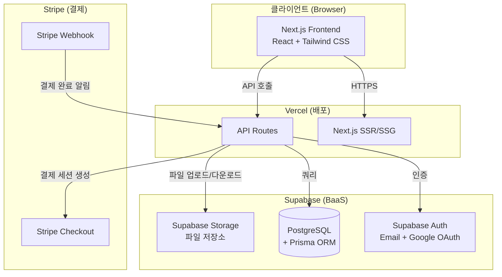
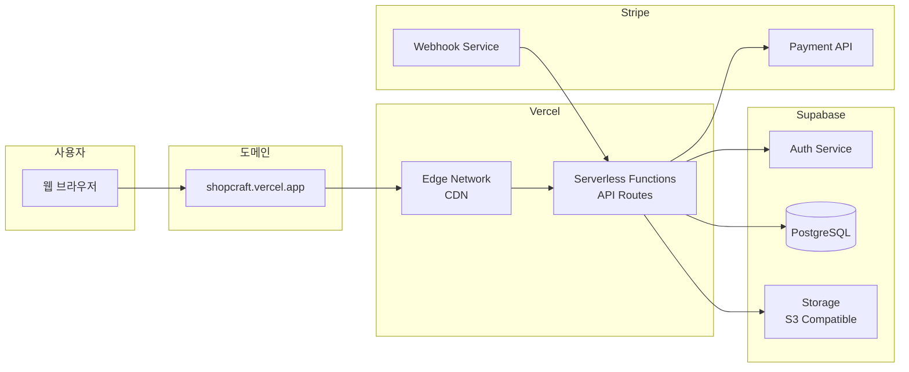

# ShopCraft - 프로젝트 개요

## 1. 프로젝트 소개

**ShopCraft**는 디지털 상품(템플릿, 아이콘, 폰트, e-book 등)을 사고팔 수 있는 마켓플레이스입니다.
판매자는 자신의 디지털 상품을 등록하고, 구매자는 결제 후 즉시 다운로드할 수 있습니다.

## 2. 프로젝트 목표

- 회원가입/로그인(OAuth 포함) 구현
- Stripe를 활용한 실제 소액 결제 구현
- 결제 후 디지털 파일 즉시 다운로드 제공
- 판매자 대시보드를 통한 매출/주문 관리
- 무료 인프라(Vercel, Supabase)를 활용한 실서비스 배포

## 3. 기술 스택

| 영역 | 기술 | 선정 이유 |
|------|------|-----------|
| Framework | **Next.js 15** (App Router) | SSR/SSG 지원, API Route 내장, Vercel 최적화 |
| Language | **TypeScript** | 타입 안전성, 개발 생산성, 포트폴리오 가치 |
| Styling | **Tailwind CSS** | 빠른 UI 개발, 일관된 디자인 시스템 |
| Auth | **Supabase Auth** | 무료 티어, OAuth 내장, RLS 연동 |
| Database | **Supabase PostgreSQL** | 무료 500MB, Realtime 지원, RLS 보안 |
| ORM | **Prisma** | 타입 안전 쿼리, 마이그레이션 관리, 직관적 스키마 |
| Payment | **Stripe** | 글로벌 표준, 테스트모드 무료, 풍부한 문서 |
| Storage | **Supabase Storage** | 무료 1GB, RLS 기반 접근 제어 |
| Deploy | **Vercel** | 무료 Hobby 플랜, Next.js 공식 배포 플랫폼 |

## 4. 시스템 아키텍처

## 5. 배포 인프라 구성

## 6. 무료 티어 한도

| 서비스 | 무료 한도 | 비고 |
|--------|-----------|------|
| Vercel Hobby | 100GB 대역폭/월, Serverless 실행 100시간/월 | 상업적 사용 불가 (포트폴리오 OK) |
| Supabase Free | DB 500MB, Storage 1GB, Auth 50,000 MAU | 프로젝트 2개까지 |
| Stripe | 테스트모드 무제한 무료 | 실결제시 건당 3.4% + 400원 |
