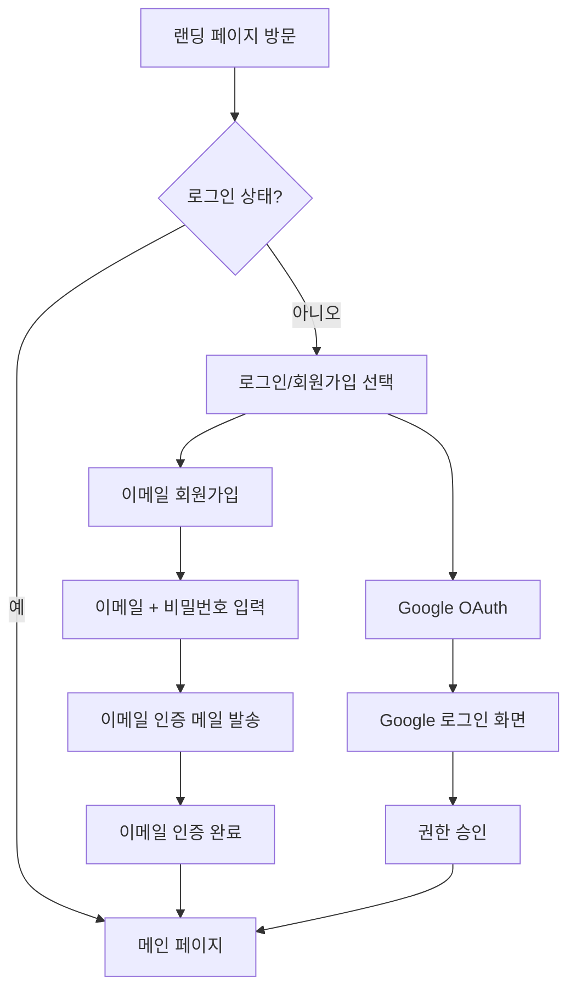
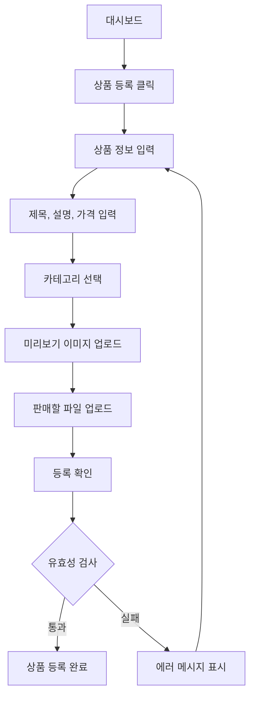
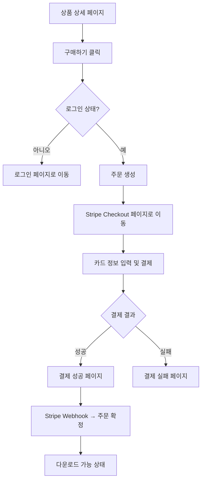
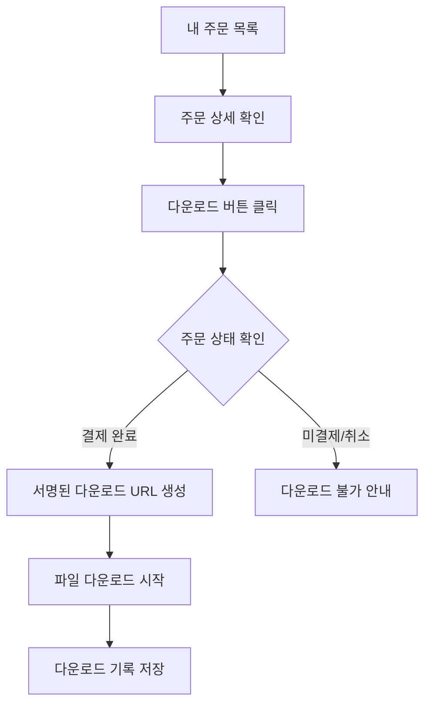

# ShopCraft - 요구사항 정의서

## 1. 사용자 역할 정의

| 역할 | 설명 | 권한 |
|------|------|------|
| **비회원 (Guest)** | 로그인하지 않은 방문자 | 상품 목록/상세 조회, 회원가입, 로그인 |
| **구매자 (Buyer)** | 로그인한 일반 사용자 | 상품 구매, 다운로드, 리뷰 작성, 주문 내역 조회 |
| **판매자 (Seller)** | 판매자 등록을 완료한 사용자 | 구매자 권한 + 상품 등록/수정/삭제, 매출 대시보드 |

> 모든 회원은 기본적으로 구매자이며, 프로필에서 판매자 등록을 하면 판매 기능이 활성화됩니다.

## 2. 기능 요구사항

### 2.1 회원관리

| ID | 기능 | 설명 | 우선순위 |
|----|------|------|----------|
| AUTH-01 | 이메일 회원가입 | 이메일 + 비밀번호로 가입, 이메일 인증 필수 | P0 |
| AUTH-02 | 이메일 로그인 | 이메일 + 비밀번호 로그인 | P0 |
| AUTH-03 | Google OAuth | Google 계정으로 간편 가입/로그인 | P0 |
| AUTH-04 | 로그아웃 | 세션 종료 | P0 |
| AUTH-05 | 비밀번호 재설정 | 이메일로 비밀번호 재설정 링크 발송 | P1 |
| AUTH-06 | 프로필 관리 | 닉네임, 프로필 이미지, 자기소개 수정 | P1 |
| AUTH-07 | 판매자 등록 | 프로필에서 판매자로 전환 (판매자명, 설명 입력) | P0 |

### 2.2 상품관리

| ID | 기능 | 설명 | 우선순위 |
|----|------|------|----------|
| PROD-01 | 상품 목록 조회 | 카테고리 필터, 검색, 정렬, 페이지네이션 | P0 |
| PROD-02 | 상품 상세 조회 | 상품 정보, 이미지, 판매자 정보, 리뷰 표시 | P0 |
| PROD-03 | 상품 등록 | 제목, 설명, 가격, 카테고리, 이미지, 파일 업로드 | P0 |
| PROD-04 | 상품 수정 | 등록된 상품 정보 수정 (본인 상품만) | P0 |
| PROD-05 | 상품 삭제 | 상품 비활성화 (소프트 삭제) | P1 |
| PROD-06 | 카테고리 관리 | 사전 정의된 카테고리 목록 제공 | P0 |
| PROD-07 | 상품 검색 | 제목, 설명 기반 텍스트 검색 | P1 |

### 2.3 결제

| ID | 기능 | 설명 | 우선순위 |
|----|------|------|----------|
| PAY-01 | 결제 세션 생성 | Stripe Checkout 세션 생성 후 결제 페이지로 리다이렉트 | P0 |
| PAY-02 | 결제 완료 처리 | Stripe Webhook으로 결제 확인 → 주문 확정 | P0 |
| PAY-03 | 결제 실패 처리 | 결제 실패 시 사용자에게 안내 | P0 |
| PAY-04 | 주문 내역 조회 | 내 구매 목록, 주문 상세 확인 | P0 |

### 2.4 다운로드

| ID | 기능 | 설명 | 우선순위 |
|----|------|------|----------|
| DL-01 | 파일 다운로드 | 결제 완료된 상품의 파일 다운로드 | P0 |
| DL-02 | 다운로드 링크 생성 | 시간 제한이 있는 서명된 URL 생성 | P0 |
| DL-03 | 다운로드 기록 | 다운로드 횟수 및 일시 기록 | P1 |

### 2.5 리뷰

| ID | 기능 | 설명 | 우선순위 |
|----|------|------|----------|
| REV-01 | 리뷰 작성 | 구매한 상품에 별점(1~5) + 텍스트 리뷰 | P1 |
| REV-02 | 리뷰 수정/삭제 | 본인 리뷰 수정 및 삭제 | P1 |
| REV-03 | 리뷰 목록 | 상품 상세 페이지에서 리뷰 목록 표시 | P1 |

### 2.6 판매자 대시보드

| ID | 기능 | 설명 | 우선순위 |
|----|------|------|----------|
| DASH-01 | 매출 통계 | 총 매출, 총 주문 수, 기간별 매출 그래프 | P1 |
| DASH-02 | 주문 관리 | 내 상품에 대한 주문 목록 조회 | P1 |
| DASH-03 | 상품 관리 | 내 상품 목록, 상태 관리 | P0 |

## 3. 비기능 요구사항

| 영역 | 요구사항 | 상세 |
|------|----------|------|
| **보안** | 인증/인가 | Supabase Auth + RLS로 데이터 접근 제어 |
| **보안** | HTTPS | Vercel 기본 SSL 적용 |
| **보안** | 파일 보안 | 서명된 URL로만 다운로드 가능, 직접 접근 차단 |
| **보안** | 결제 보안 | Stripe Webhook 서명 검증 |
| **성능** | 페이지 로드 | LCP 2.5초 이내 (Next.js SSR/SSG 활용) |
| **성능** | 이미지 최적화 | Next.js Image 컴포넌트로 자동 최적화 |
| **접근성** | 반응형 | 모바일/태블릿/데스크톱 지원 |
| **접근성** | 시맨틱 HTML | 스크린 리더 호환 |

## 4. 유저 플로우

### 4.1 회원가입/로그인 플로우

### 4.2 상품 등록 플로우 (판매자)

### 4.3 구매/결제 플로우

### 4.4 다운로드 플로우

## 5. 페이지 구조

| 페이지 | URL | 접근 권한 | 설명 |
|--------|-----|-----------|------|
| 랜딩 | `/` | 전체 | 서비스 소개, 인기 상품 |
| 로그인 | `/login` | 비회원 | 이메일/Google 로그인 |
| 회원가입 | `/signup` | 비회원 | 이메일/Google 가입 |
| 상품 목록 | `/products` | 전체 | 필터, 검색, 페이지네이션 |
| 상품 상세 | `/products/:id` | 전체 | 상품 정보, 리뷰 |
| 상품 등록 | `/products/new` | 판매자 | 상품 등록 폼 |
| 상품 수정 | `/products/:id/edit` | 판매자(본인) | 상품 수정 폼 |
| 결제 성공 | `/checkout/success` | 회원 | 결제 완료 안내 |
| 결제 실패 | `/checkout/cancel` | 회원 | 결제 실패 안내 |
| 내 주문 | `/orders` | 회원 | 구매 내역 |
| 주문 상세 | `/orders/:id` | 회원 | 주문 상세 + 다운로드 |
| 프로필 | `/profile` | 회원 | 프로필 수정 |
| 대시보드 | `/dashboard` | 판매자 | 매출 통계, 상품/주문 관리 |
